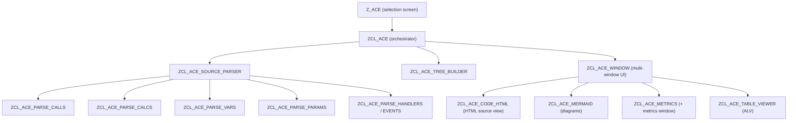

# ACE — ABAP Code Explorer

**Read any ABAP program like a map — without starting a single debugger session.**

ACE is a SAP GUI tool that parses ABAP source statically and answers the questions you normally
burn hours on in the debugger: what calls what, where a value really comes from, which branch is
actually reachable, and how risky a piece of code is. It never executes the analysed code and
never changes it — it only reads the source.

> **Also outside SAP GUI.** The code metrics are available in Eclipse ADT and in VS Code through
> [VERTEX](https://github.com/ysichov/VERTEX) · [Marketplace](https://marketplace.visualstudio.com/items?itemName=YuriiSychov.vertex-abap).
> It reads ACE over an ADT resource that lives in
> [Simple-Data-Explorer](https://github.com/ysichov/Simple-Data-Explorer), so both repositories
> have to be on the system.
>
> *In the construction phase.* Metrics only so far — the call map, the slicing and the skeletons
> are still SAP GUI.

[](LICENSE)


---

## What ACE gives you

| The situation you are in | What you normally do | What ACE does |
|---|---|---|
| You inherited a 6000-line report and have to change it by Friday | Set breakpoints, find a transaction that reaches the code, hope you have the right data | Open it, read the call tree and the flow diagram — no data, no transaction, no authorizations needed |
| "Where does this field get its value from?" | Watchpoints, step-through, restart, repeat | Double-click the variable → ACE shows every statement that contributes to it, across method and FORM boundaries |
| "What will my change break?" | Where-used list, then guessing | Static call map of the whole program or package, with depth control |
| "Which parts of this legacy object are dangerous?" | Gut feeling | McCabe complexity, Halstead, Maintainability Index per method/FORM/module, hotspots sorted |
| "I need to explain this object to a colleague or an LLM" | Copy 3000 lines of source | Skeleton view — structure, calls and DB access with line numbers, on one screen |

Concretely, ACE lets you:

- **Analyse code you cannot run.** Debugging needs the right transaction, the right data, the right
  authorizations, and often a system you do not have. ACE needs only the object name and read access
  to the source.
- **Do backward program slicing ("watchpoints without the debugger").** Mark one or more variables and
  ACE builds the data dependency chain that produces them — resolving parameter renaming
  (`IV_` → `EV_` and back) at any call depth.
- **See the whole picture instead of one call stack.** Call flow, static class/call map and control
  structure schemes as Mermaid diagrams, clickable back into the source.
- **Ignore the noise.** *Only Z* mode follows customer code only (`Z*`, `Y*` and `/NAMESPACE/*`),
  so SAP standard does not flood the picture.
- **Work on several objects at once.** Every object opens in its own window — as many as your screen fits.
- **Move on to the real tools when needed.** One click opens the current unit in Eclipse (ADT); breakpoints
  can be set straight from the ACE source view.

Typical users: consultants dropped into an unfamiliar system, developers taking over foreign code,
reviewers doing impact analysis before an upgrade, and anyone who has to document a system nobody
remembers writing.

---

## Table of contents

- [What ACE gives you](#what-ace-gives-you)
- [Demo](#demo)
- [Requirements](#requirements)
- [Installation](#installation)
  - [Option A: abapGit (recommended)](#option-a-abapgit-recommended)
  - [Option B: single file](#option-b-single-file)
  - [Optional: Mermaid diagrams](#optional-mermaid-diagrams)
- [Quick start](#quick-start)
- [Entry points](#entry-points)
- [The ACE window](#the-ace-window)
  - [Layout](#layout)
  - [Object tree](#object-tree)
  - [Source viewer](#source-viewer)
  - [Main toolbar](#main-toolbar)
  - [Source view toolbar](#source-view-toolbar)
- [Features](#features)
  - [Code Flow](#code-flow)
  - [Data dependency analysis](#data-dependency-analysis)
  - [Diagrams](#diagrams)
  - [Branch scheme](#branch-scheme)
  - [Skeleton](#skeleton)
  - [Code metrics](#code-metrics)
  - [Package mode](#package-mode)
  - [Enhancements](#enhancements)
  - [Event handlers](#event-handlers)
  - [Breakpoints and ADT](#breakpoints-and-adt)
  - [Only Z and Depth](#only-z-and-depth)
  - [Steps table](#steps-table)
  - [Smart Debugger handoff](#smart-debugger-handoff)
- [Typical workflows](#typical-workflows)
- [How it works](#how-it-works)
- [Limitations](#limitations)
- [Repository layout](#repository-layout)
- [Development](#development)
- [Version history](#version-history)
- [Credits and links](#credits-and-links)
- [License](#license)

---

## Demo

[Short video demo (Loom)](https://www.loom.com/share/250574c07071496c8c9b064062bb44dc?sid=dee80fda-5f6d-4384-8457-c53ab97d09e8)

Selection screen — type an object name and press **Enter**:


The analysis window — tree, source and units:


Multi-window: open as many objects as your display fits:


---

## Requirements

| | |
|---|---|
| **Backend** | SAP NetWeaver AS ABAP **7.50+** (modern ABAP syntax: `NEW`, `VALUE`, `COND`, string templates) |
| **Frontend** | SAP GUI **for Windows** — the UI is built on GUI controls (ALV, ABAP editor control, HTML viewer, splitters) |
| **Authorizations** | Read access to the source of the objects you analyse (`S_DEVELOP` display) |
| **Optional** | [abapMermaid](https://github.com/WegnerDan/abapMermaid) for the diagram windows |

ACE is read-only: it parses source from the repository and never executes the analysed object.
The only write operations it can perform are the breakpoints you set yourself from the source view.

---

## Installation

### Option A: abapGit (recommended)

1. Install [abapGit](https://abapgit.org/) if it is not there yet.
2. Create a package, e.g. `$ACE` (local) or a transportable `ZACE`.
3. In abapGit: **New Online** → repository `https://github.com/ysichov/ACE` → your package.
4. **Pull** and activate all objects.
5. Run report `Z_ACE`.

### Option B: single file

If you cannot use abapGit, `src/z_ace_standalone.prog.abap` is the whole tool merged into one report
(generated with [abapmerge](https://github.com/larshp/abapmerge), post-processed to compile on 7.50).

1. `SE38` → create report `Z_ACE_STANDALONE` (executable program).
2. Paste the content of [`src/z_ace_standalone.prog.abap`](src/z_ace_standalone.prog.abap).
3. Activate and run.

> The standalone file is **generated**. Never edit it by hand — change the individual classes and
> regenerate (see [Development](#development)).

### Optional: Mermaid diagrams

The diagram windows need [abapMermaid](https://github.com/WegnerDan/abapMermaid) installed in the same
system. At startup ACE checks for class `ZCL_WD_GUI_MERMAID_JS_DIAGRAM`; if it is missing, the
**Flow** and **Map** buttons are simply not shown and everything else keeps working.

---

## Quick start

1. Run report **`Z_ACE`** (SE38 / SA38, or create a transaction for it).
2. Type a program name into **Program** and press **Enter**.
   *F8 is deliberately disabled — **Enter** is what launches the analysis.*
3. A new analysis window opens. On the left you get the object tree, on the right the source.
4. Double-click any node in the tree (event, FORM, method, function) to jump to it.
5. Press **Code Flow** to build the linear execution sequence, or **Map** for the static call map.
6. Open another object from the selection screen — it appears in its own window, side by side.

---

## Entry points

The selection screen accepts several object types; all of them are resolved to the underlying
program/include that ACE parses.

| Field | You enter | ACE opens |
|---|---|---|
| **Program** | Report, module pool, include | the program itself |
| **Package** | Development package | every `PROG` / `CLAS` / `INTF` / `FUGR` in it, parsed lazily on demand — see [Package mode](#package-mode) |
| **Class** | Global class or interface | the class pool (`ZCL_X====CP`) or interface pool (`====IP`) |
| **Function module** | FM name | the generated include of the function group (via `TFDIR`) |
| **OData service** | Gateway project | the backend service class (via `/IWBEP/I_MGW_SRH`) |
| **WDC component** | Web Dynpro component | the generated component class (via `CL_WDY_WB_NAMING_SERVICE`) |

---

## The ACE window

### Layout

```
┌──────────────────────────────────────────────────────────────┐
│ main toolbar: Flow · Map · Code Flow · Handlers · Only Z ...  │
├───────────────────────┬──────────────────────────────────────┤
│                       │ view toolbar: view mode · fold · ... │
│  Objects & Code Flow  ├──────────────────────────────────────┤
│  tree (35%)           │                                      │
│                       │  Source viewer (classic or HTML)     │
│                       │                                      │
├───────────────────────┴──────────────────────────────────────┤
│  Units / steps (ALV)                                         │
└──────────────────────────────────────────────────────────────┘
```

Every analysed object gets its own dialog window, so several programs can be compared side by side.

### Object tree

The left panel ("Objects & Code Flow") is built lazily — subnodes are parsed when you expand them,
so opening a huge program stays fast. It contains:

- includes and their structure
- events (`START-OF-SELECTION`, `AT SELECTION-SCREEN`, …)
- FORMs and dialog modules
- function modules of the group
- global and local classes, with the class hierarchy
- methods, their parameters and local variables
- global variables
- enhancements

Double-click behaviour:

- **on a code node** (event / FORM / method / module): navigate to that unit in the source viewer;
- **on a variable**: toggle it as a *selection* (bold = selected). Selected variables drive the
  [data dependency analysis](#data-dependency-analysis) — this is the "watchpoint without debugging".

### Source viewer

Two rendering modes, switched with the first button of the view toolbar:

- **Classic** — the SAP ABAP editor control. Double-click a call to navigate into it, click the left
  border to toggle a breakpoint.
- **HTML** — a rendered view with clickable calls, collapsible control structures (`IF`/`LOOP`/`CASE`…),
  a breakpoint gutter (click = session breakpoint, **Ctrl+click** = external breakpoint) and colouring
  that separates calls and DB access from ordinary statements.

Navigation keeps a history, so you can walk into a chain of calls and come back.

### Main toolbar

| Button | What it does |
|---|---|
| **Run** | Copies the Smart Debugger script to the clipboard and submits the analysed report — see [Smart Debugger handoff](#smart-debugger-handoff) |
| **Flow** | Mermaid diagram of the traced execution flow *(needs abapMermaid)* |
| **Map** | Static call map — the whole picture of classes/programs and their calls *(needs abapMermaid)* |
| **Code Flow** | Builds the linear code flow sequence of the current unit — see [Code Flow](#code-flow) |
| **Show All Steps / Only Calculated** | Toggles between the full flow and only the statements that contribute to the selected variables |
| **Handlers** | Builds the flow of all registered event handlers of the object |
| **Only Z / Z & Standard** | Whether the parser follows calls into SAP standard code — see [Only Z and Depth](#only-z-and-depth) |
| **Depth ◀ n ▶** | Call nesting depth the parser follows (0–99, default 19). Click the number to type a value |
| **Metrics** | McCabe / Halstead / Maintainability Index report — see [Code metrics](#code-metrics) |
| **Steps** | Opens the internal steps table in an ALV popup with filters |
| **Get whole Class** | Merges the local includes of a global class (`CCDEF`, `CCIMP`, `CCMAC`, `CCAU`) into one source view |
| **ADT** | Opens the current unit in Eclipse via an `adt://` link, positioned on the current line |
| **Info** | Opens this documentation |

### Source view toolbar

| Button | What it does |
|---|---|
| **Classic view / HTML view** | Switches source rendering |
| **Collapse all / Expand all** | Folds every control structure (HTML view only) |
| **Scheme** | Opens the [branch scheme](#branch-scheme) of the current unit. Each click opens a *new* popup, so branches can be compared side by side |
| **Skeleton** | Text [skeleton](#skeleton) of the unit: structure, calls and DB access with line numbers |

---

## Features

### Code Flow

**Code Flow** ("code mix") builds the sequence of statements that would be executed, starting from the
selected unit and walking into every call it can resolve statically — up to the configured
[depth](#only-z-and-depth). The result is a single synthetic source view (`Code_Flow_Mix`) where code
from several includes, FORMs and methods is stitched together in execution order, with the call
hierarchy marked by indentation and arrows.

Empty block pairs (`IF`/`ENDIF`, `LOOP`/`ENDLOOP` with nothing left inside after filtering) are removed,
and branches whose body contributes nothing are dimmed, so what remains is the code that actually matters.

### Data dependency analysis

This is the feature the tool was built for. In programming theory it is called **backward program
slicing** / data dependency analysis; some languages have tooling for it, and now ABAP does too.

1. Navigate to a unit and expand its variables in the tree.
2. Double-click one or more variables — they turn bold.
3. Press **Code Flow** (and optionally **Only Calculated**).

ACE walks the flow backwards and keeps only the statements that contribute to the selected variables,
resolving parameter bindings across call boundaries (a value passed as `iv_x` and received as `ev_y`
keeps being tracked) at any depth.

Example from the screenshot below — variable `EV_SAL` was selected and **Code Flow** produced:

1. `EV_SAL` needs `lv_income` and `lv_deduct`,
2. how `lv_deduct` is calculated,
3. how `lv_income` is calculated,
4. and that `lv_income` needs field `rate` from table `zempl_rates`.


For cases like this you need neither the standard debugger nor the Smart Debugger to find where a
value comes from.

### Diagrams

Two Mermaid diagram windows (both require [abapMermaid](#optional-mermaid-diagrams)):

- **Flow** — the traced execution flow: which unit calls which, in the order the code would run.
- **Map** — the static call map: programs, classes and their calls as a whole picture, independent of
  any single entry point.

Diagram windows have their own toolbar: vertical/horizontal layout, call parameters on/off, external
calls on/off, "programs and classes only" vs. "all blocks (events/FORMs/methods)", depth control, and
export of the raw Mermaid text. Clicking a node navigates the source window to that unit — or opens a
separate source popup, if you switch the node-click mode.

### Branch scheme

**Scheme** renders the control structure of the current unit alone: the `IF`/`CASE`/`LOOP` skeleton with
the stretches of plain statements collapsed into "N operations" nodes that you can expand. It answers
"what shape does this method have" without reading it line by line. Each click opens a new popup, so
you can keep the scheme of one branch open while you look at another.

### Skeleton

**Skeleton** produces a compact text description of the unit: its structure, the calls it makes and the
database access it performs, each with line numbers. It is meant for two things — reading a long method
in one screen, and pasting into an AI assistant as context instead of thousands of lines of source.

### Code metrics

**Metrics** opens an HTML report computed from the parsed source, per code unit (method / FORM / module /
program level), grouped by class and sorted by hotspot:

- **McCabe cyclomatic complexity** (CC) with a risk rating
- **Halstead metrics** — distinct/total operators and operands (η1, η2, N1, N2), vocabulary, length,
  volume `V`, difficulty `D`, effort `E`, time `T = E/18`, expected bugs `B = V/3000`
- **Maintainability Index** — `MI = 171 - 5.2·ln(V) - 0.23·CC - 16.2·ln(LOC)` with a rating
- **LOC / logical LOC / comment LOC**

Aggregates are also produced per class and per include, with a legend explaining every column.

### Package mode

Enter a **Package** instead of a program and ACE builds a tree of everything in it, grouped by object
type (Programs, Classes, Interfaces, Function Groups). Objects are parsed on demand when you open them.

The **Map** diagram in package mode shows the whole package; double-clicking an object focuses the map
on it, and double-clicking the package root zooms back out.

### Enhancements

Implicit and explicit enhancement implementations are collected and woven into the source ACE shows, so
the code you read is the code that runs — enhancements appear in the tree and in the flow rather than
being invisible the way they are in a plain `SE38` display.

### Event handlers

**Handlers** builds the flow of every event handler registered in the object (`SET HANDLER` bindings are
resolved to the handling method) and shows them as one sequence. Useful for GUI/ALV-driven programs
where the interesting code hangs off events and is never called explicitly.

### Breakpoints and ADT

- Click the left border (classic view) or the gutter dot (HTML view) to toggle a **session breakpoint**;
  **Ctrl+click** sets an **external breakpoint**. They are real breakpoints (`RS_SET_BREAKPOINT`), so you can
  set them while reading and then run the program normally.
- **ADT** opens the current object and line in Eclipse through an `adt://` URL — class pools, function
  groups, includes and programs are all mapped to the right ADT path, namespaces included.

### Only Z and Depth

- **Only Z** (default) makes the parser follow calls only into customer code — names starting with `Z`,
  `Y` or a customer namespace `/…/`. Switch to **Z & Standard** to walk into SAP code too.
- **Depth** limits how many call levels the parser follows (0–99, default 19). Lower it when a program
  explodes into hundreds of calls, raise it when the interesting logic sits deeper.

Both settings apply to the flow, the diagrams and the slicing.

### Steps table

**Steps** opens the internal step table (the parsed execution sequence: step, stack level, program,
include, unit type and name) in an ALV popup with a select-options style filter panel, for when you want
to search and sort the flow as data rather than read it as code.

### Smart Debugger handoff

ACE grew out of [Smart Debugger](https://github.com/ysichov/Smart-Debugger), which did the same kind of
analysis from inside a debugger script. The **Run** button keeps the bridge: it copies the
`Z_SMART_DEBUGGER_SCRIPT` source to the clipboard and submits the analysed report, so you can paste the
script into the debugger's script editor when you do need runtime values.

---

## Typical workflows

**"I have to change this report by Friday and nobody knows it."**
Open the program → expand the tree to see the events and FORMs → **Map** for the overall shape →
**Metrics** to find the parts that will fight back → **Code Flow** on the event you have to touch.

**"Where does this amount come from?"**
Navigate to the unit that returns it → expand its variables → double-click the variable →
**Code Flow** + **Only Calculated** → read the chain, top to bottom.

**"What does this OData service actually do?"**
Enter the Gateway project in **OData service** → ACE resolves the backend class → **Handlers** or
**Code Flow** on the relevant `*_GET_ENTITYSET` method.

**"Where should refactoring start?"**
Enter the **Package** → open each object → **Metrics** → sort by cyclomatic complexity and
Maintainability Index.

**"Give an LLM enough context without pasting 4000 lines."**
Navigate to the unit → **Skeleton** → copy the text.

---

## How it works



Source is read from the repository and tokenised with the ABAP scanner; the specialised parsers turn the
token stream into tables of calls, variables, parameter bindings, calculations and event registrations.
All of these structures are declared in one place, `ZIF_ACE_PARSE_DATA` — the first file to read when
working on the internals. Everything else (tree, flow, diagrams, metrics) is a view over those tables.

| Object | Role |
|---|---|
| `z_ace.prog.abap` | Entry point — selection screen and object resolution |
| `z_ace_standalone.prog.abap` | Generated single-file build of the whole tool |
| `zcl_ace.clas.abap` | Orchestrator; owns the flow/slicing algorithm |
| `zcl_ace_source_parser.clas.abap` | Core parser and call scanner |
| `zcl_ace_parser.clas.abap` | Coordinates parsing of a statement |
| `zcl_ace_parse_calls / calcs / vars / params / handlers / events` | Specialised extractors |
| `zcl_ace_stmts / combi / exprs / keywords` | ABAP statement grammar |
| `zcl_ace_tree_builder.clas.abap` | Builds the navigation tree |
| `zcl_ace_rtti_tree.clas.abap` | Tree control, node interaction |
| `zcl_ace_window.clas.abap` | Analysis window, toolbars, navigation |
| `zcl_ace_code_html.clas.abap` | HTML source rendering, folding, skeleton |
| `zcl_ace_mermaid.clas.abap` | Mermaid diagram generation |
| `zcl_ace_metrics.clas.abap` / `zcl_ace_metrics_window.clas.abap` | Metrics calculation and report |
| `zcl_ace_table_viewer / sel_opt / alv_common` | ALV popups with select-options filters |
| `zif_ace_parse_data.intf.abap` | Central type contract |

---

## Limitations

- **Static analysis.** Dynamic calls (`CALL METHOD (lv_name)`, `PERFORM (lv_form) IN PROGRAM (lv_prog)`,
  dynamic BAdI resolution) cannot be followed — only what is visible in the source.
- **Depth limited.** The parser follows calls up to the *Depth* setting (default 19) to keep large
  programs responsive.
- **SAP GUI for Windows only.** The UI is built on GUI controls; the HTML view relies on the frontend's
  embedded browser control.
- **Diagrams need abapMermaid.** Without it, the tool works but the two diagram buttons are hidden.
- **Beta.** Version 0.5 — parsing of exotic constructs may still be incomplete. Issues and pull requests
  are welcome.

---

## Repository layout

```
src/                          all ABAP sources (.abap + .xml metadata pairs)
  z_ace.prog.abap             entry point
  z_ace_standalone.prog.abap  generated single-file build
  zcl_ace*.clas.abap          implementation classes
  zif_ace_*.intf.abap         type and handler interfaces
.abapgit.xml                  abapGit configuration (PREFIX folder logic, /src/)
.abaplint.json                abaplint configuration
generate_standalone.sh|.bat   standalone build script
```

---

## Development

- Sources are maintained in this repository and deployed to SAP with **abapGit**.
- The standalone report is produced by `generate_standalone.sh`, which merges the sources with
  [abapmerge](https://github.com/larshp/abapmerge), restores the header comment block and rewrites
  `+=` / `-=` into 7.50-compatible assignments (the script fails loudly if any slip through).
  **`z_ace_standalone.prog.abap` is generated output — always change the individual classes and
  regenerate.**
- New parsing logic belongs in a specialised `ZCL_ACE_PARSE_*` class; new data belongs in
  `ZIF_ACE_PARSE_DATA` so every view sees the same contract.
- Comments in the code are English only.

---

## Version history

- **beta 0.5** — refactoring into specialised parser classes, HTML source view with folding and
  breakpoint gutter, branch scheme, skeleton export, package mode with focused class map, ADT links,
  metrics report (McCabe / Halstead / MI).
- **Update 2** — programs, FORMs, functions, classes, methods and their parameters added to the
  navigation tree; double-click on a variable acts as a watchpoint for the code flow mixer, giving
  data dependency analysis (backward slicing) without a debugger.
- **Update 1** — *Ask AI* button to discuss code with an AI model (Smart Debugger script).
- **Origin** — the idea moved out of the [Smart Debugger](https://github.com/ysichov/Smart-Debugger)
  ABAP debugger script into a normal program: analysing code flow should not require a debug session.

---

## Credits and links

- Author: **Yurii Sychov** — [ysichov@gmail.com](mailto:ysichov@gmail.com) ·
  [blog](https://ysychov.wordpress.com/blog/) · [LinkedIn](https://www.linkedin.com/in/ysychov/)
- [Smart Debugger](https://github.com/ysichov/Smart-Debugger) — the predecessor of ACE
- [abapMermaid](https://github.com/WegnerDan/abapMermaid) by Daniel Wegner — diagram rendering
- [vibing-steampunk](https://github.com/oisee/vibing-steampunk)
- Newest source of the entry point: [`src/z_ace.prog.abap`](https://github.com/ysichov/ACE/blob/main/src/z_ace.prog.abap)

---

## License

[MIT](LICENSE) © 2025 Yurii Sychov
